<!-- MDTOC maxdepth:6 firsth1:1 numbering:0 flatten:0 bullets:1 updateOnSave:1 -->

- [JetBrains全家桶 IDE 常用技巧](#jetbrains全家桶-ide-常用技巧)   
   - [激活](#激活)   
   - [启用Vim](#启用vim)   
   - [启用Vim相对行号](#启用vim相对行号)   
   - [鼠标滚动放大/缩小字体](#鼠标滚动放大缩小字体)   
   - [格式化代码](#格式化代码)   
   - [注释](#注释)   
   - [删除](#删除)   
   - [复制](#复制)   
   - [选中区域自动包裹括号引号](#选中区域自动包裹括号引号)   
   - [自动补全启用大小写支持](#自动补全启用大小写支持)   
   - [代码缩进及反缩进](#代码缩进及反缩进)   
   - [快速实现接口](#快速实现接口)   
   - [修改注释颜色](#修改注释颜色)   
   - [选中区域大小写转换](#选中区域大小写转换)   
   - [已打开文件之间切换](#已打开文件之间切换)   
   - [代码折叠及展开](#代码折叠及展开)   
   - [GoLand](#goland)   
      - [Goland配置源代理](#goland配置源代理)   
      - [Goland配置GOPATH（未启用module）](#goland配置gopath（未启用module）)   
   - [PyCharm](#pycharm)   
   - [Clion](#clion)   
   - [IDEA](#idea)   

<!-- /MDTOC -->
# JetBrains全家桶 IDE 常用技巧

## 激活

1. 套路：重置试用来达到无限试用目的(试用期将过时重新操作一番)

* 参考：<https://gitee.com/pengzhile/ide-eval-resetter>

```
1. Download and install plugin from [Download Link](https://plugins.zhile.io/files/ide-eval-resetter-2.1.14-d2fedb86.zip).
    * Alternative installation method:
        * Add "Custom Plugin Repository": `https://plugins.zhile.io` manually (`Settings/Preferences` -> `Plugins`)
        * Search and install plugin: `IDE Eval Reset`
2. Click `Help` or `Get Help` -> `Eval Reset` menu.
3. Click `Reset` -> `Yes` button.
4. Restart your IDE.
5. Now you have another 30 days eval time :)
6. For more information, visit [here](https://zhile.io/2020/11/18/jetbrains-eval-reset-da33a93d.html).
```


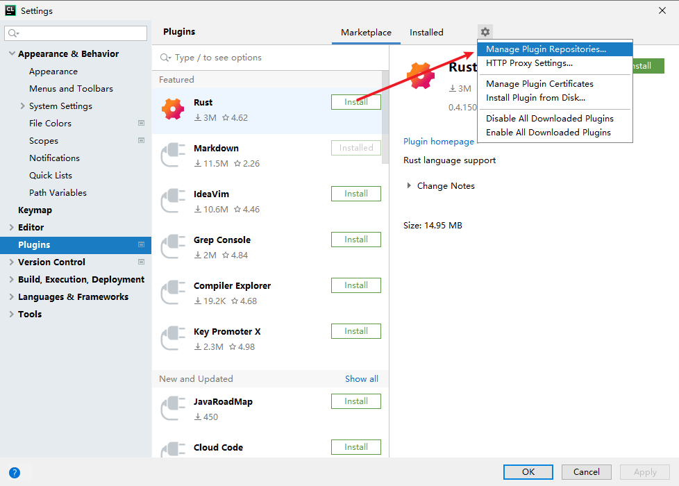

添加仓库


```
https://plugins.zhile.io
```

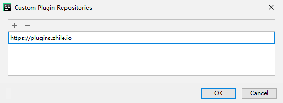

安装 IDE Eval Reset

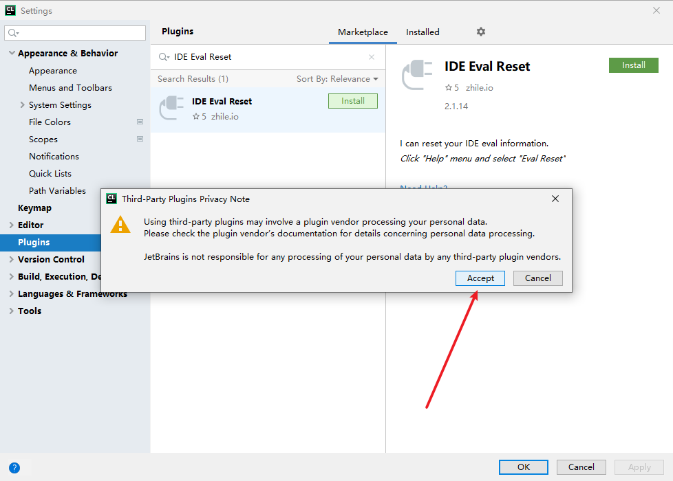

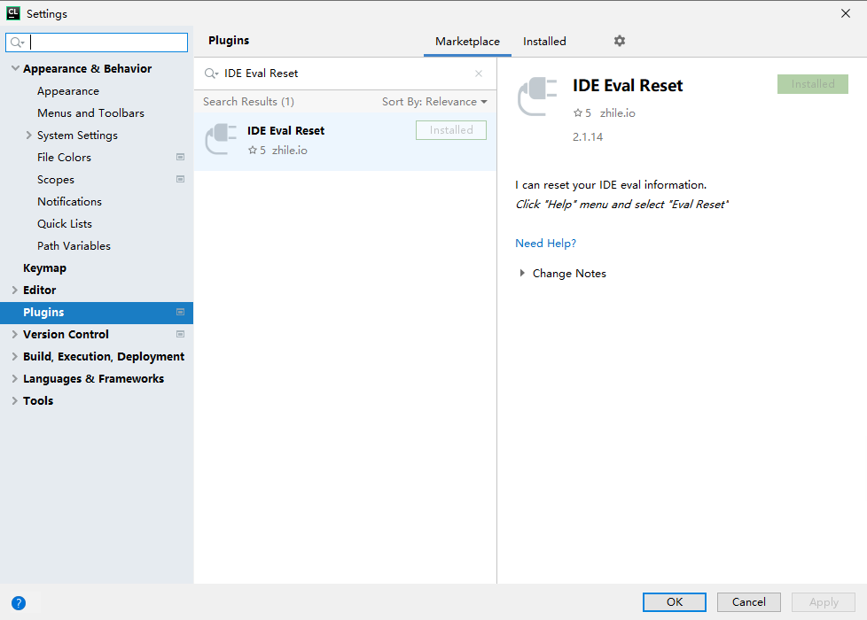

Reset 重置试用，延长一个月试用期

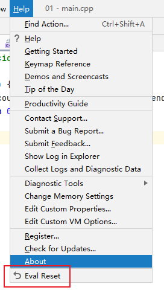

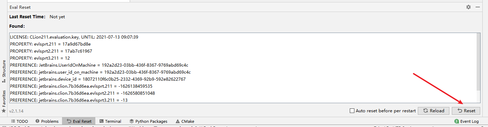


## 启用Vim

File->Settings->Plugins 安装IdeaVim插件


File->Settings->Keymap 选择**适合**自己的开关，用于Vim模式和Idea模式快速切换


## 启用Vim相对行号

右小脚IdeaVim标志，没有配置则会创建，有配置就是open，添加vimrc内容即可

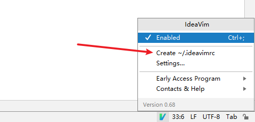

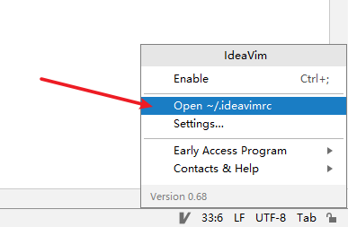


```
"" Source your .vimrc
"source ~/.vimrc

set nm
set relativenumber
```


## 鼠标滚动放大/缩小字体

方法一：


方法二：

File->Settings->Keymap 搜索中输入increase


File->Settings->Keymap 搜索中输入decrease


## 格式化代码

```
Ctrl + Alt + L (小写l)
```

## 注释

默认光标所在行注释，若选中多行则都会注释

```
Ctrl + /
```

## 删除

默认删除光标所在行，若选中多行则都会删除

```
Ctrl + x
```

## 复制

默认复制光标所在行，若选中多行则都会复制

```
Ctrl + d
```

## 选中区域自动包裹括号引号

```
Surround selection on typing quote or brace
```

Editor -> General -> Smart Keys


## 自动补全启用大小写支持

```
Match case
```

Edirotr -> Gneeral -> Code Completion


## 代码缩进及反缩进

```
缩进：Tab
反缩进：Shift + Tab
```

## 快速实现接口

在 type struct 上使用


## 修改注释颜色

Editor -> Color Scheme -> Python

颜色：07A728

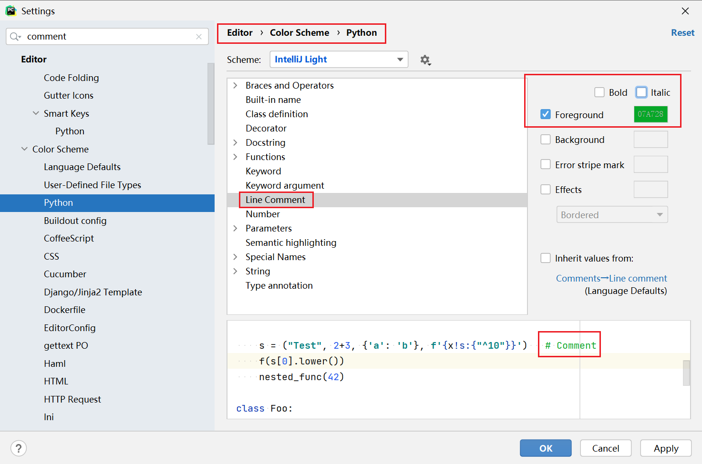

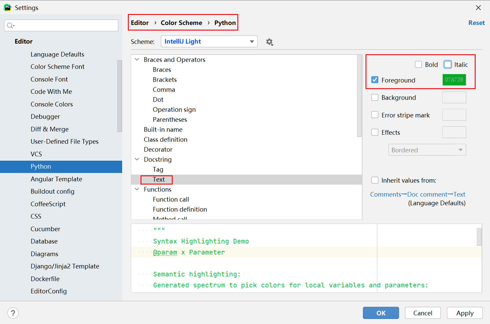


## 选中区域大小写转换

Ctrl + Shift + u(小写)

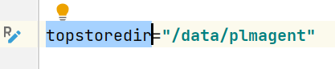

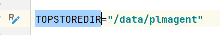

一般是局部变量转为全局变量时候用到


## 已打开文件之间切换

```
Ctrl + Tab
```

## 代码折叠及展开

```
所有代码折叠：Ctrl  +Alt + -
所有代码展开：Ctrl + Alt + +
折叠某一点：Ctrl + -
展开某一层：Ctrl + +
```

## GoLand

### Goland配置源代理

```
GOPROXY = https://goproxy.cn,direct
```

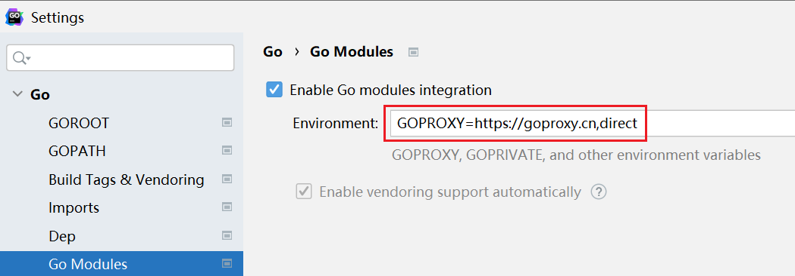

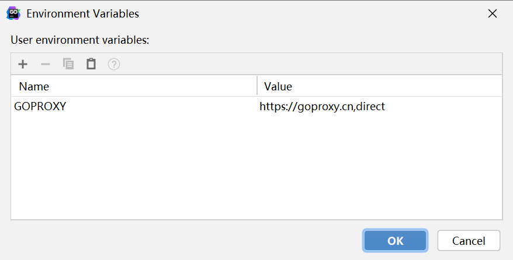


### Goland配置GOPATH（未启用module）


* Golang 的包搜索是从 GOPATH 和 GOROOT 路径下搜索
* 源码必须要放在 GOROOT 或 GOPATH 的 **src 目录下**才能找到

例如新增GOPATH配置路径为```/home/nicyou/git/zinx```，则实际生效的路径应该是
```/home/nicyou/git/zinx/src```


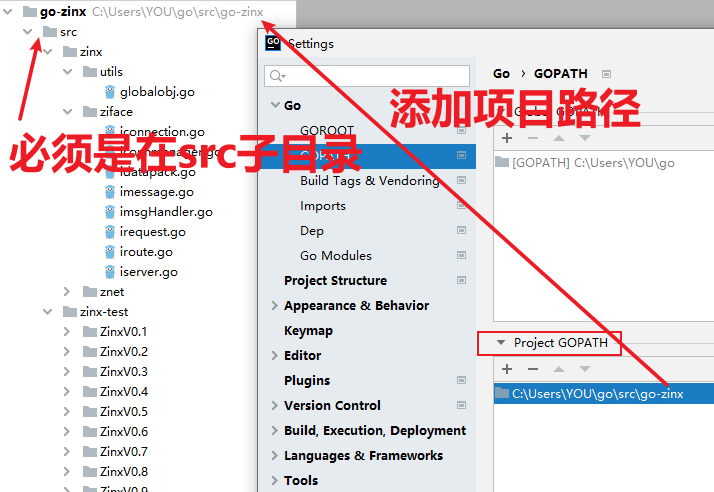

## PyCharm


## Clion


## IDEA


---
