<!-- MDTOC maxdepth:6 firsth1:1 numbering:0 flatten:0 bullets:1 updateOnSave:1 -->

- [JetBrains全家桶 IDE 常用技巧](#jetbrains全家桶-ide-常用技巧)   
   - [启用Vim](#启用vim)   
   - [鼠标滚动放大/缩小字体](#鼠标滚动放大缩小字体)   
   - [格式化代码](#格式化代码)   
   - [注释](#注释)   
   - [删除](#删除)   
   - [复制](#复制)   
   - [选中区域自动包裹括号引号](#选中区域自动包裹括号引号)   
   - [自动补全启用大小写支持](#自动补全启用大小写支持)   
   - [代码缩进及反缩进](#代码缩进及反缩进)   
   - [快速实现接口](#快速实现接口)   

<!-- /MDTOC -->

# JetBrains全家桶 IDE 常用技巧

## 启用Vim

File->Settings->Plugins 安装IdeaVim插件

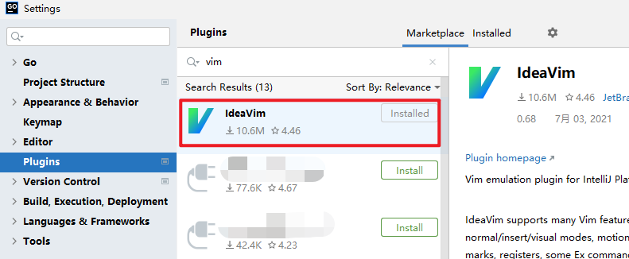

File->Settings->Keymap 选择**适合**自己的开关，用于Vim模式和Idea模式快速切换


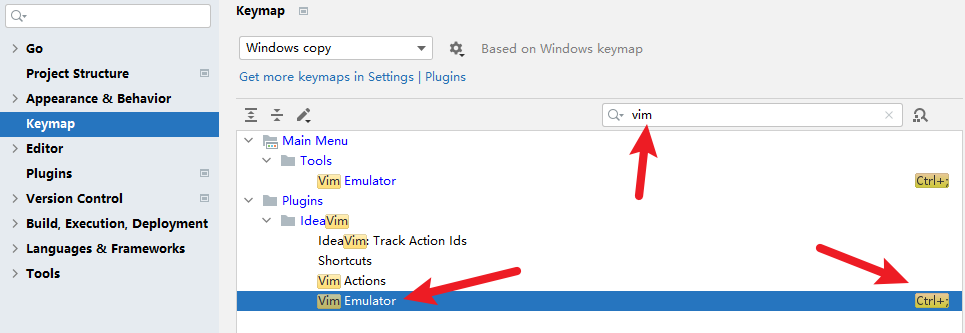

## 鼠标滚动放大/缩小字体

方法一：

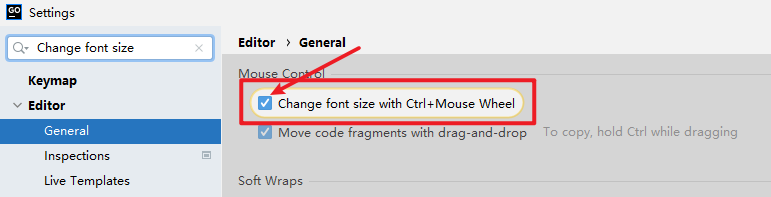

方法二：

File->Settings->Keymap 搜索中输入increase

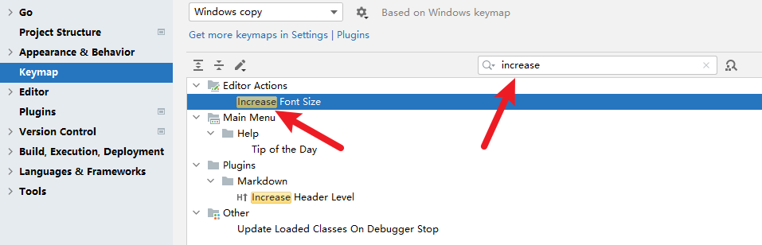

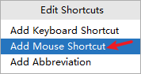

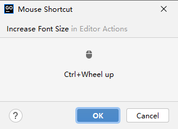

File->Settings->Keymap 搜索中输入decrease

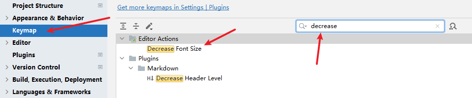

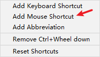

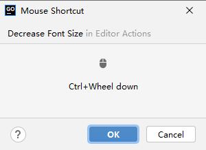

## 格式化代码

```
Ctrl + Alt + L (小写l)
```

## 注释

默认光标所在行注释，若选中多行则都会注释

```
Ctrl + /
```

## 删除

默认删除光标所在行，若选中多行则都会删除

```
Ctrl + x
```

## 复制

默认复制光标所在行，若选中多行则都会复制

```
Ctrl + d
```

## 选中区域自动包裹括号引号

```
Surround selection on typing quote or brace
```

Editor -> General -> Smart Keys

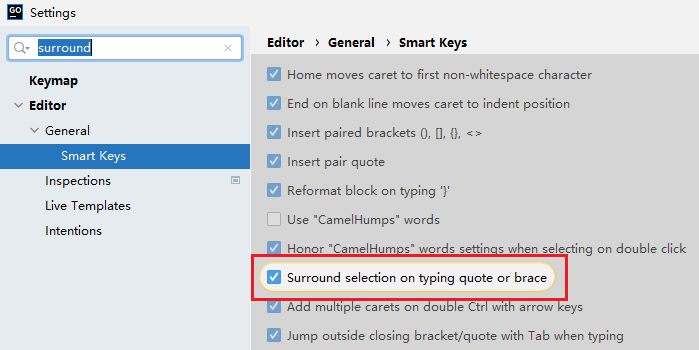


## 自动补全启用大小写支持

```
Match case
```

Edirotr -> Gneeral -> Code Completion

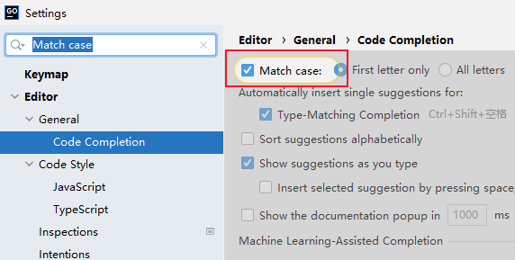


## 代码缩进及反缩进

```
缩进：Tab
反缩进：Shift + Tab
```

## 快速实现接口

在 type struct 上使用

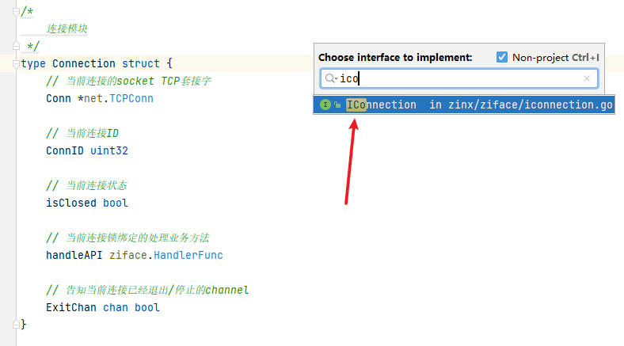


---
